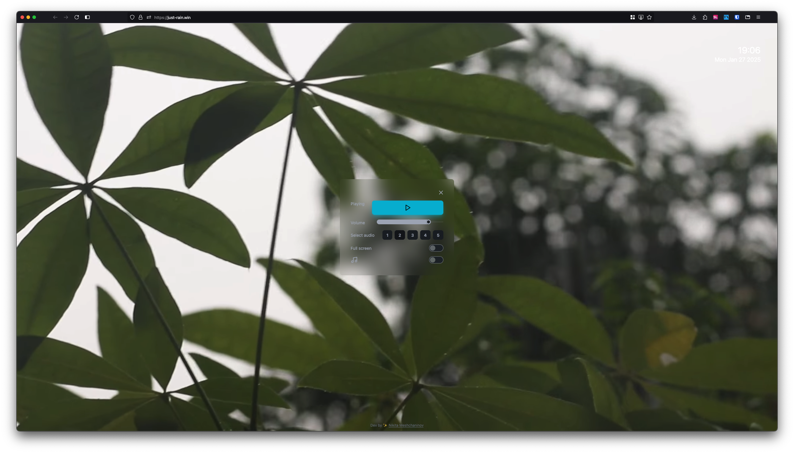

# Just-Rain 🌧️



Welcome to **Just-Rain**, a calming and immersive web experience that brings the soothing ambiance of rain and thunderstorms right to your screen. Built with **SvelteKit**, this project is designed to help you relax, focus, or simply enjoy the beauty of nature's sounds and visuals.

## Features ✨

- **Realistic Rain Videos**: Watch high-quality, looped videos of rain falling in various settings.
- **Thunderstorm Soundscapes**: Listen to the calming sounds of rain and distant thunder.
- **Jazz Music Option**: Toggle on smooth jazz music to play alongside the rain for an even more relaxing atmosphere.
- **Minimalist Design**: A clean and distraction-free interface to enhance your experience.
- **Responsive Layout**: Works seamlessly on both desktop and mobile devices.
- **PWA Support**: Save Just-Rain to your device as a Progressive Web App (PWA) and enjoy it offline.

## How to Use 🚀

1. **Visit the Site**: Open [Just-Rain](https://just-rain.win) in your browser.
2. **Choose Your Rain**: Select from different rain scenes
3. **Adjust Volume**: Use the volume slider to control the intensity of the rain and thunder sounds.
4. **Toggle Jazz Music**: Enable or disable smooth jazz music to complement the rain.
5. **Save as PWA**: Install Just-Rain as a PWA on your device for offline access.
6. **Relax**: Sit back, relax, and let the rain wash away your stress.

## Tech Stack 💻

- **Frontend**: SvelteKit
- **Styling**: Tailwind CSS

## Installation 🛠️

To run this project locally, follow these steps:

1. Clone the repository:
   ```bash
   git clone https://github.com/meshchaninov/just-rain.git
   ```
2. Navigate to the project directory:
   ```bash
   cd just-rain
   ```
3. Install dependencies:
   ```bash
   npm install
   ```
4. Start the development server:
   ```bash
   npm run dev
   ```
5. Open your browser and visit `http://localhost:5173`.

## Contributing 🤝

Contributions are welcome! If you'd like to improve Just-Rain, feel free to open an issue or submit a pull request. Please ensure your code follows the project's coding standards.

---

Enjoy the rain! 🌧️  
*"Sometimes, you just need to sit back, listen to the rain, and let nature do the talking."*