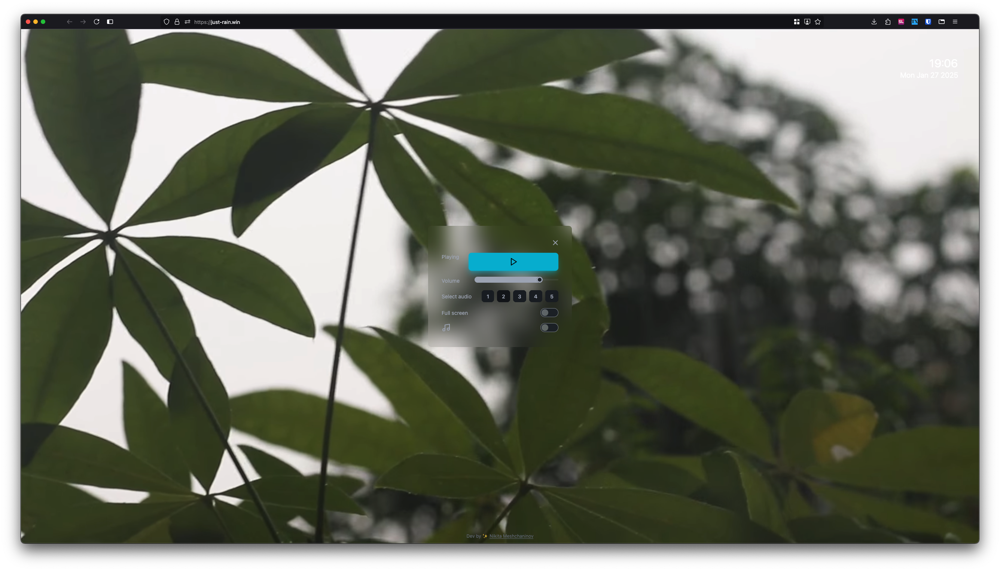

# [Just-Rain](https://rain.dzle.org) 🌧️



Welcome to **Just-Rain**, a calming and immersive web experience that brings the soothing ambiance of rain and thunderstorms right to your screen. Built with **SvelteKit**, this project is designed to help you relax, focus, or simply enjoy the beauty of nature's sounds and visuals.

## Features ✨

- **Realistic Rain Videos**: Watch high-quality, looped videos of rain falling in various settings.
- **Thunderstorm Soundscapes**: Listen to the calming sounds of rain and distant thunder.
- **Jazz Music Option**: Toggle on smooth jazz music to play alongside the rain for an even more relaxing atmosphere.
- **Minimalist Design**: A clean and distraction-free interface to enhance your experience.
- **Responsive Layout**: Works seamlessly on both desktop and mobile devices.
- **PWA Support**: Save Just-Rain to your device as a Progressive Web App (PWA) and enjoy it offline.

## How to Use 🚀

1. **Visit the Site**: Open [Just-Rain](https://just-rain.win) in your browser.
2. **Choose Your Rain**: Select from different rain scenes
3. **Adjust Volume**: Use the volume slider to control the intensity of the rain and thunder sounds.
4. **Toggle Jazz Music**: Enable or disable smooth jazz music to complement the rain.
5. **Save as PWA**: Install Just-Rain as a PWA on your device for offline access.
6. **Relax**: Sit back, relax, and let the rain wash away your stress.

### Samsung TV browser

The production build includes a legacy bundle for 2017 Samsung TVs running
Tizen 3.0 / Chromium 47, including UE43M5503. Open the deployed site in the TV
browser and use the arrow keys to navigate, Enter to select, and Back to close
the menu. Audio playback still requires an initial user action because of
browser autoplay restrictions.

### Samsung TV application (WGT)

The repository also contains a Tizen 3.0 TV application configured for the
Samsung UE43M5503. It provides 11 TV-compatible H.264 rain backgrounds,
disables the TV pointer, and uses the remote's D-pad, Enter, and Back buttons.

Build the Tizen project and an unsigned package:

```bash
npm run build:tizen
```

The command creates `dist/tizen/JustRainTV/` and
`dist/tizen/JustRainTV-unsigned.wgt`. The unsigned archive is useful for
inspection, but Samsung TVs only install a WGT signed with a Samsung TV
certificate that includes the TV's DUID.

For a small development package that streams compatible H.264 video and audio
from `https://rain.dzle.org/`, run:

```bash
npm run build:tizen:dev
```

This creates `dist/tizen/JustRainTVDev-unsigned.wgt`. It still needs a developer
signature. The deployed site must contain the files under `video/tv/` before the
streaming package is installed.

The TV application loads `media-manifest.js` when it starts. This manifest is
generated automatically from `static/video/tv/*.mp4` and `static/audio/*.mp3`
during the site build. Adding or removing media therefore only requires a site
deployment; the installed streaming WGT does not need to be rebuilt.

Apps2Samsung can sign and install the development WGT without installing Tizen
Studio. The TV must be in Developer Mode, and its Host PC IP must match the
computer running the installer.

Alternatively, after creating a Samsung TV certificate in Tizen Studio, sign
the full offline project with the Certificate Manager or the Tizen CLI:

```bash
tizen build-web -- dist/tizen/JustRainTV
tizen package -t wgt -s YOUR_CERTIFICATE_PROFILE -- dist/tizen/JustRainTV/.buildResult
```

## Tech Stack 💻

- **Frontend**: SvelteKit
- **Styling**: Tailwind CSS

## Installation 🛠️

To run this project locally, follow these steps:

1. Clone the repository:
   ```bash
   git clone https://github.com/meshchaninov/just-rain.git
   ```
2. Navigate to the project directory:
   ```bash
   cd just-rain
   ```
3. Install dependencies:
   ```bash
   npm install
   ```
4. Start the development server:
   ```bash
   npm run dev
   ```
5. Open your browser and visit `http://localhost:5173`.

## Contributing 🤝

Contributions are welcome! If you'd like to improve Just-Rain, feel free to open an issue or submit a pull request. Please ensure your code follows the project's coding standards.

---

Enjoy the rain! 🌧️  
_"Sometimes, you just need to sit back, listen to the rain, and let nature do the talking."_
